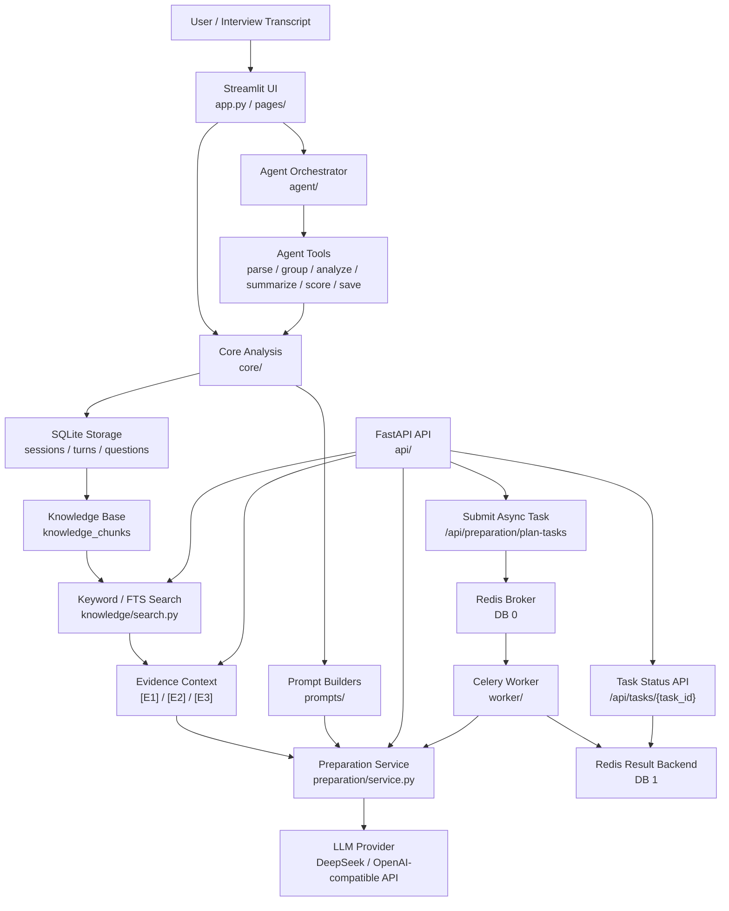
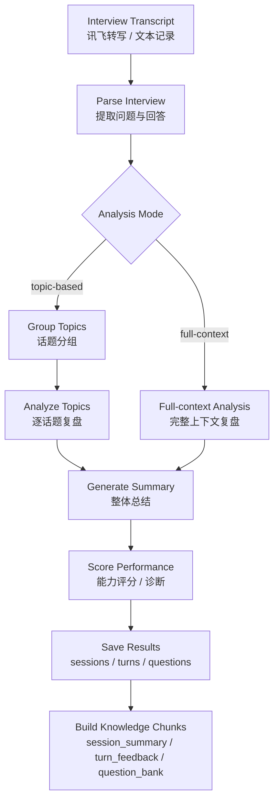
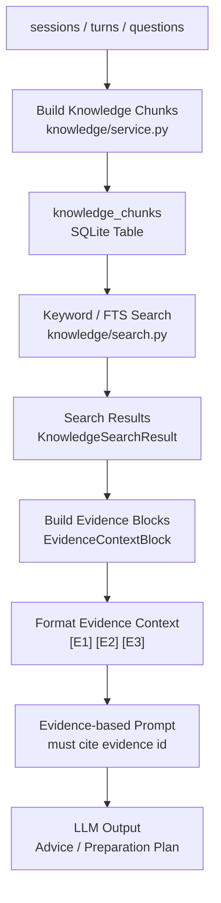
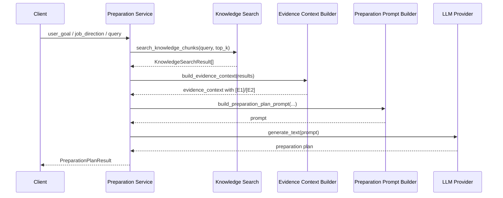
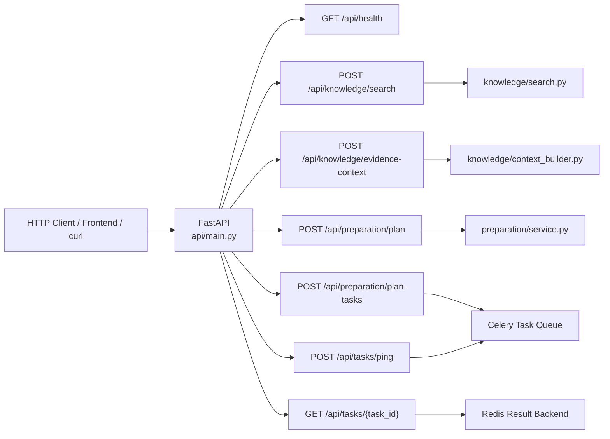
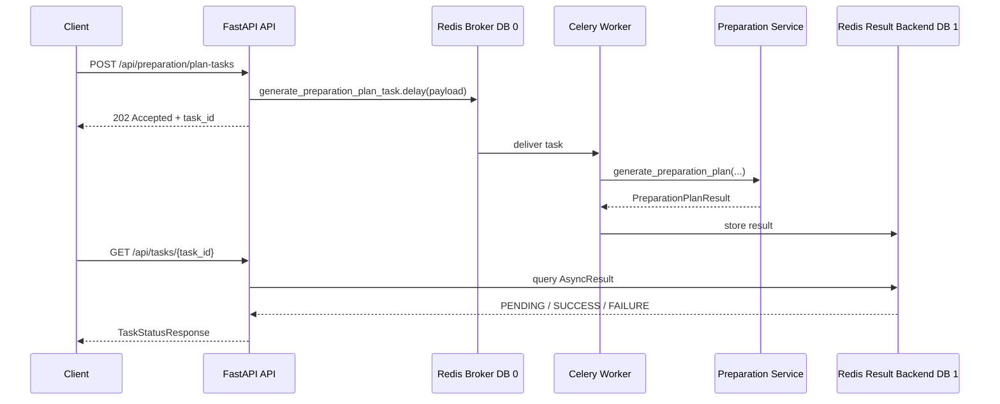
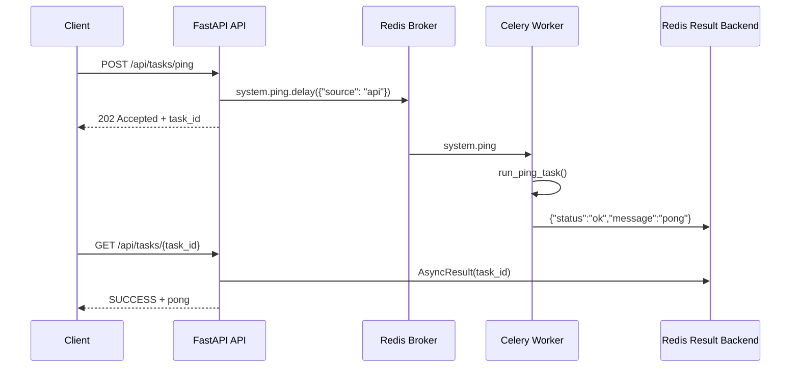
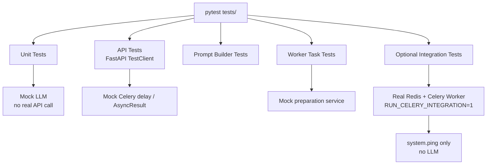
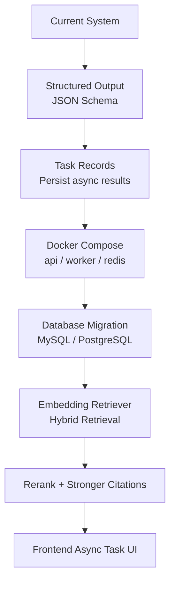

# InterviewAce Architecture

## 1. Architecture Overview

InterviewAce 从 Streamlit MVP 演进为支持知识库检索、Evidence Context、FastAPI API 和 Celery 异步任务的 AI 面试复盘与准备系统。

当前架构分为 UI 层、核心分析层、知识库层、准备计划层、API 层、异步任务层和测试层。系统重点不是简单调用 LLM，而是把“面试转写 -> 复盘分析 -> 知识沉淀 -> 证据检索 -> 准备计划”串成可测试、可服务化的闭环。

## 2. Overall System Architecture

说明：

- Streamlit 是原始 MVP UI，用于本地上传转写和查看复盘结果。
- FastAPI 是服务化接口层，对外提供检索、证据上下文、准备计划和任务状态接口。
- `knowledge/` 负责历史复盘知识沉淀、幂等索引和 keyword / FTS 检索。
- `preparation/` 负责基于 evidence 生成准备计划。
- `worker/` 负责异步执行长耗时 LLM 任务。
- Redis DB 0 默认作为 broker，Redis DB 1 默认作为 result backend。

## 3. Interview Review Flow

说明：

- topic-based 保留原有分组分析能力。
- full-context 利用长上下文模型减少跨轮信息丢失。
- 分析结果保存到 `sessions`、`turns`、`questions` 后，可以进一步沉淀为 `knowledge_chunks`。

## 4. Evidence-based RAG Flow

当前 RAG 链路是 keyword / SQLite FTS 检索 + Evidence Context，不是 embedding retriever，也没有实现向量数据库或 rerank。

防幻觉约束：

- 每条证据有稳定编号，例如 `[E1]`。
- 历史表现判断必须引用证据编号。
- 证据不足必须写“历史证据不足”。
- 不能把“建议补充展示”写成“候选人已经做到”。
- 空 evidence 时不允许生成具体历史表现判断。

## 5. Preparation Plan Generation Flow

说明：

- `preparation.service` 只负责编排 search -> evidence -> prompt -> LLM。
- Prompt Builder 只构造 Prompt，不调用 LLM。
- Search / Evidence / Prompt 逻辑不复制到 API 层。

## 6. FastAPI Layer

说明：

- API 层只做请求校验、依赖获取和响应转换。
- Router 不写 SQL。
- Router 不拼 Prompt。
- Router 不直接初始化 LLM client。

## 7. Celery / Redis Async Task Flow

Ping task 验收链路：

说明：

- `system.ping` 用于验证 Redis -> Worker -> Result Backend，不调用 LLM。
- `preparation.generate_plan` 会调用真实 LLM，不作为默认自动测试。
- 默认 pytest 不依赖 Redis。

## 8. Module Responsibility Map

| Module | Responsibility |
|---|---|
| `app.py / pages/` | Streamlit MVP UI |
| `core/` | Transcript parsing, LLM analysis, storage |
| `agent/` | Agent orchestrator and tool chain |
| `prompts/` | Prompt templates and prompt builders |
| `knowledge/` | `knowledge_chunks`, repository, search, evidence context |
| `preparation/` | Preparation request/result schema and service orchestration |
| `api/` | FastAPI routers, Pydantic schemas, HTTP response conversion |
| `worker/` | Celery app and async task execution |
| `tests/` | Unit tests, API tests, optional integration tests |
| `scripts/` | Local startup scripts |
| `docs/` | Project documentation |

## 9. Testing Architecture

说明：

- 默认测试不调用真实 LLM。
- 默认测试不依赖 Redis。
- Integration test 默认 skip。
- 真实 Redis + worker 验证通过 `system.ping` 完成。

## 10. Current Limitations

- 当前 RAG 主要是 keyword / SQLite FTS，不是 embedding retriever。
- 当前未实现 rerank。
- 当前未实现模型微调。
- 当前 LLM 输出主要是 Markdown，后续可做 JSON Schema 结构化输出。
- 当前异步任务结果主要依赖 Redis result backend，尚未持久化到 `task_records` 表。
- 当前 SQLite 适合 MVP 和本地演示，生产可迁移 MySQL / PostgreSQL。
- 当前没有完整用户系统和权限控制。

## 11. Roadmap Architecture

这部分是后续架构方向，不代表当前已经实现。

